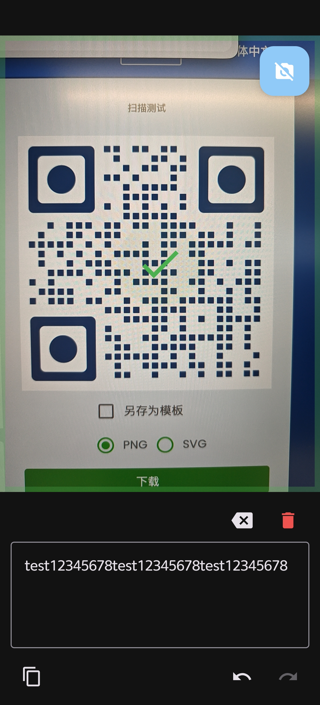
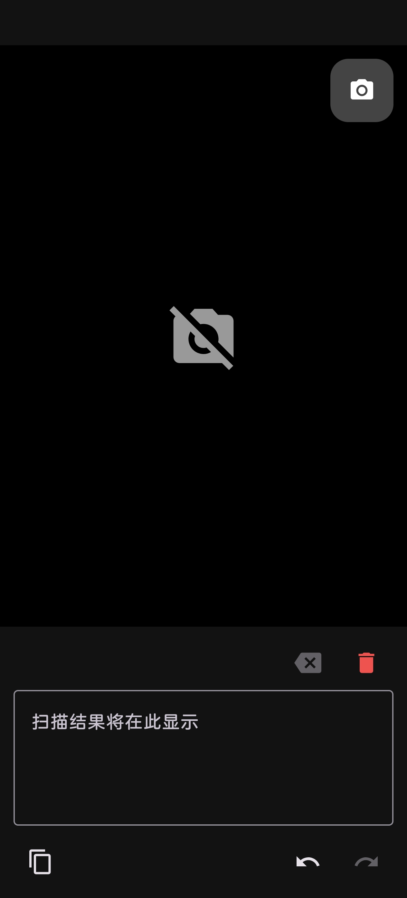
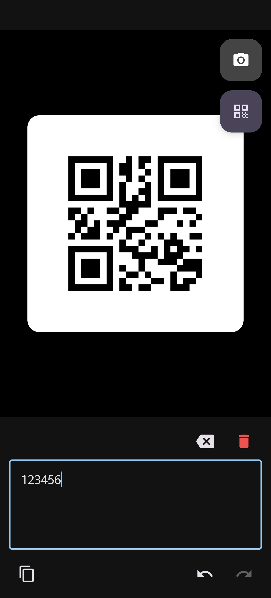

# QRCode — 二维码扫描文本编辑器

一个轻量级的 Android 二维码扫描工具，结合实时取景识别与文本编辑功能。扫码结果自动追加到可编辑文本框，支持撤销/恢复、复制、清空等操作，适合连续扫码场景。

## ✨ 功能特性

- **实时扫码** — CameraX + ML Kit Barcode，连续扫描不中断
- **文本编辑器** — 扫码结果自动追加，支持手动编辑
- **撤销/恢复** — 统一快照栈管理，扫码与手动编辑共享 undo/redo
- **复制到剪贴板** — 一键复制，带短暂提示反馈
- **相机控制** — 一键关闭/开启摄像头，权限缺失引导
- **扫描动效** — 绿色边框闪烁 + 对勾动画，扫码成功一目了然
- **震动反馈** — 扫码成功时触发 30ms 短震动（API 31+ 走 VibratorManager，低版本回退 Vibrator，无马达设备静默跳过）
- **二维码生成** — 右上角「生成二维码」按钮（位于相机开关键下方），基于 ZXing 将文本框内容生成为二维码，叠加显示在取景框区域
- **暗色主题** — 跟随系统主题自动切换亮暗色

## 🏗 技术栈

| 层次 | 技术 | 版本 |
|------|------|------|
| 语言 | Kotlin | 2.0.21 |
| UI 框架 | Jetpack Compose + Material 3 | BOM 2024.10.00 |
| 扫码方案 | CameraX + ML Kit Barcode Scanning | CameraX 1.4.0 / MLKit 17.3.0 |
| 二维码生成 | ZXing core | 3.5.3 |
| 震动反馈 | Vibrator / VibratorManager | API 31+ 分支 |
| 架构 | MVVM + 单 Activity | — |
| 构建系统 | Gradle + Version Catalog | AGP 8.13.2 |
| 最低 SDK | 34 | targetSdk 36 |
| 测试 | JUnit 4 + kotlinx-coroutines-test | — |

## 📱 页面结构

上下分栏布局：上半部分为相机取景框（权重 1），下半部分为文本编辑器（固定高度 240dp）。

|            二维码识别            | 关闭摄像头 |              二维码生成               |
|:-----------------------------:|:---:|:--------------------------------:|
|  |  |  |

## 🚀 快速开始

### 前置条件

- Android Studio Ladybug（2024.x）或更高版本
- JDK 17+
- 一台 Android 14+（API 34）真机（或模拟器带摄像头）

### 克隆 & 构建

```bash
git clone https://github.com/your-username/QRCode.git
cd QRCode
./gradlew assembleDebug
```

或在 Android Studio 中打开项目根目录，等待 Gradle Sync 完成后直接 Run。

### 运行测试

```bash
./gradlew test
```

当前包含 **21 个单元测试**，覆盖 ViewModel 核心逻辑（撤销/恢复栈、debounce、动效定时、扫码暂停、二维码生成与 toggle、扫码互斥等）。

## 📖 使用方式

1. 首次启动会请求相机权限，点击允许
2. 将二维码对准摄像头，识别后文本自动追加到下方文本框
3. 可用下方工具栏操作：撤销/恢复、复制、清空、退格
4. 文本框支持直接编辑，编辑操作与扫码共享 undo/redo 栈
5. 右上角按钮可以随时开关摄像头
6. 在文本框输入内容后，点击右上角第二个「二维码」图标即可生成二维码并叠加显示在取景框区域；再次点击该图标或点击叠加层任意位置即可隐藏
7. 二维码叠加层显示期间，相机取景框会自动关闭（黑屏占位），扫码暂停；隐藏后取景框自动恢复

## 📁 项目结构

```
app/
├── src/main/java/com/example/qrcode/
│   ├── MainActivity.kt                 # 单 Activity 入口
│   ├── ui/
│   │   ├── ScannerScreen.kt            # 根布局（上下分栏编排）
│   │   ├── CameraSection.kt            # 相机区域（预览/权限/动效/开关）
│   │   ├── TextEditorSection.kt        # 文本编辑区域
│   │   └── theme/Theme.kt              # Material3 亮暗主题
│   ├── viewmodel/
│   │   └── ScannerViewModel.kt         # 核心状态管理 & 业务逻辑
│   └── util/
│       └── BarcodeAnalyzer.kt          # ML Kit 二维码分析器（ImageAnalysis.Analyzer）
├── src/test/java/.../
│   └── ScannerViewModelTest.kt         # ViewModel 单元测试
└── src/main/res/                       # 资源文件（字符串/图标/主题/xml）
```

## 🧠 设计要点

- **统一快照栈**：扫码追加和手动编辑共享 undo/redo 栈，500ms debounce 防抖
- **扫码暂停保护**：扫码成功后触发 800ms 动画，期间暂停分析，防止重复触发
- **纯 Compose 动效**：扫描成功动效完全由 Compose 动画系统实现，无需自定义 View
- **Resourceful 相机管理**：关闭相机时释放 CameraX 资源，减少耗电
- **生成与预览互斥**：二维码叠加层显示时通过 `when` 分支前置渲染 `CameraOffPlaceholder`，避免 CameraX 绑定；`onScanSuccess` 也会被 `showGeneratedQr` 守卫拦截，扫码与生成不会相互干扰
- **Toggle 交互**：同一按钮承担「生成」与「隐藏」职责，状态由 `showGeneratedQr` 单一来源驱动，UI 一致性更强

## ⚖️ 许可

```
MIT License

Copyright (c) 2026
```

---

> 用 CameraX 和 ML Kit 构建，为连续扫码场景量身定制。
