# QRCode — 系统详细设计文档

> 版本：1.0 | 最后更新：2026-07-13

---

## 1. 项目概述

QRCode 是一个单页面 Android 应用，核心功能为**连续扫描二维码**并将识别文本**实时追加**到可编辑文本框中，附带完整的撤销/恢复、复制、清空等文本编辑能力。

### 1.1 设计目标

- 连续扫码零中断，无需手动切换
- 扫码结果与手动编辑统一管理，不给用户两套不一致的撤销逻辑
- 扫码成功给予明确的视觉反馈
- 极简交互，单页面完成所有操作

### 1.2 非目标（YAGNI）

- 不支持条形码（仅 QR_CODE）
- 不支持从相册识别
- 不支持历史记录持久化
- 不支持多语言（仅简体中文）
- 不支持横屏（仅竖屏）
- 不支持主题切换（跟随系统）

---

## 2. 系统架构

### 2.1 架构总览

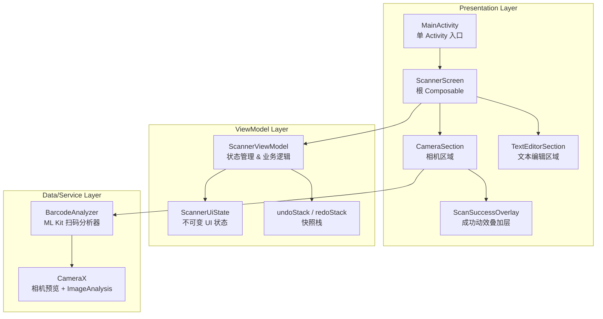

### 2.2 分层职责

| 层级 | 组件 | 职责 |
|------|------|------|
| **Presentation** | Composable 组件 | 渲染 UI、分发用户事件、管理动画 |
| **ViewModel** | ScannerViewModel | 维护 UI 状态、管理撤销栈、处理扫码/编辑/复制业务逻辑 |
| **Data/Service** | BarcodeAnalyzer + CameraX | 相机预览、图像帧分析、二维码识别 |

### 2.3 数据流方向

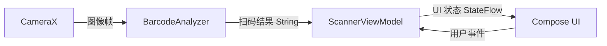

---

## 3. 组件设计

### 3.1 组件树

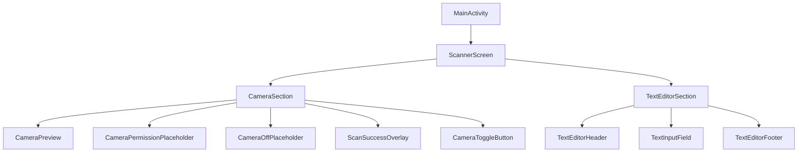

### 3.2 组件详述

#### 3.2.1 MainActivity

- **路径**：`MainActivity.kt`
- **类型**：`ComponentActivity`（单 Activity 模式）
- **职责**：启用 edge-to-edge 显示，注入 `QRCodeTheme`，挂载 `ScannerScreen`
- **配置**：AndroidManifest 中锁定竖屏（`screenOrientation="portrait"`），键盘模式 `adjustResize`

#### 3.2.2 ScannerScreen

- **路径**：`ui/ScannerScreen.kt`
- **类型**：`@Composable`
- **布局**：`Column` 上下分栏
- **职责**：
  - 实例化 `ScannerViewModel`
  - 收集 UI State 流
  - 触发相机权限请求（`LaunchedEffect` + `rememberCameraPermissionLauncher`）
  - 编排 CameraSection（上半部分，`weight(1f)`）和 TextEditorSection（下半部分，固定 `240.dp`）

#### 3.2.3 CameraSection

- **路径**：`ui/CameraSection.kt`
- **职责**：相机区域容器，处理三种状态：

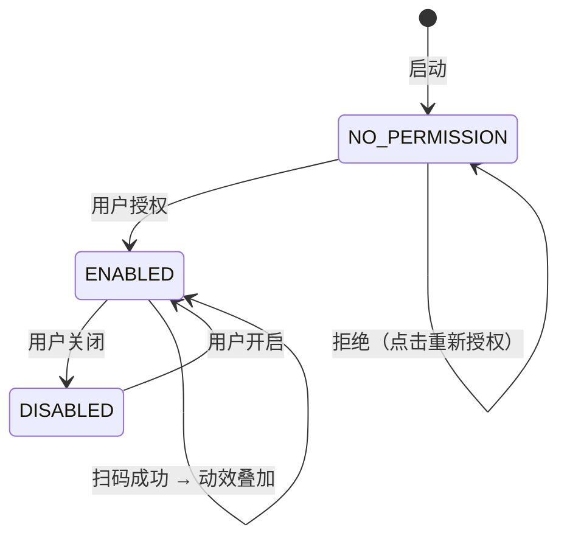

- **子组件**：
  - `CameraPreview`：CameraX PreviewView 封装，绑定 `ProcessCameraProvider`
  - `CameraPermissionPlaceholder`：权限缺失时显示，点击触发授权
  - `CameraOffPlaceholder`：相机关闭时显示黑屏 + 图标
  - `ScanSuccessOverlay`：扫码成功动效（Compose 动画实现）
  - `CameraToggleButton`：开关按钮（FAB，右上角）

#### 3.2.4 CameraPreview

- **职责**：封装 CameraX 生命周期绑定
- **实现**：`AndroidView` 承载 `PreviewView`，`LaunchedEffect` 中异步绑定 `ProcessCameraProvider`
- **ImageAnalysis**：`STRATEGY_KEEP_ONLY_LATEST`，绑定 `BarcodeAnalyzer`

#### 3.2.5 BarcodeAnalyzer

- **路径**：`util/BarcodeAnalyzer.kt`
- **类型**：实现 `ImageAnalysis.Analyzer`
- **关键设计**：

```kotlin
class BarcodeAnalyzer(
    private val onResult: (String) -> Unit
) : ImageAnalysis.Analyzer {
    private val scanner = BarcodeScanning.getClient(
        BarcodeScannerOptions.Builder()
            .setBarcodeFormats(Barcode.FORMAT_QR_CODE)
            .build()
    )
    @Volatile private var busy = false
}
```

- **扫码流程**：

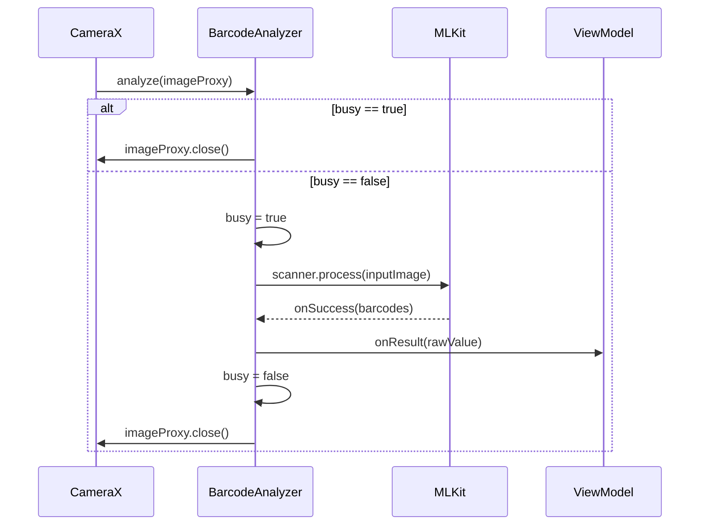

- **防重复机制**：`@Volatile busy` 标志位，处理期间跳过后续帧
- **格式限制**：仅识别 `Barcode.FORMAT_QR_CODE`

#### 3.2.6 TextEditorSection

- **路径**：`ui/TextEditorSection.kt`
- **职责**：文本编辑区域容器
- **子组件**：
  - `TextEditorHeader`：右上角退格（`Backspace`）和清空（`Delete`）按钮
  - `TextInputField`：`OutlinedTextField`，等宽字体，最小 4 行
  - `TextEditorFooter`：底部复制、撤销（`Undo`）、恢复（`Redo`）按钮，复制成功后短暂显示"已复制"提示

#### 3.2.7 ScannerViewModel

- **路径**：`viewmodel/ScannerViewModel.kt`
- **类型**：继承 `ViewModel`
- **UI 状态**：

```kotlin
data class ScannerUiState(
    val text: String = "",           // 文本框当前内容
    val canUndo: Boolean = false,     // 是否可撤销
    val canRedo: Boolean = false,     // 是否可恢复
    val cameraEnabled: Boolean = true,// 相机是否开启
    val hasCameraPermission: Boolean = false, // 是否拥有相机权限
    val scanSuccess: Boolean = false, // 是否在扫码成功动效中
    val copied: Boolean = false       // 是否刚完成复制
)
```

- **内部状态**（非 UI）：

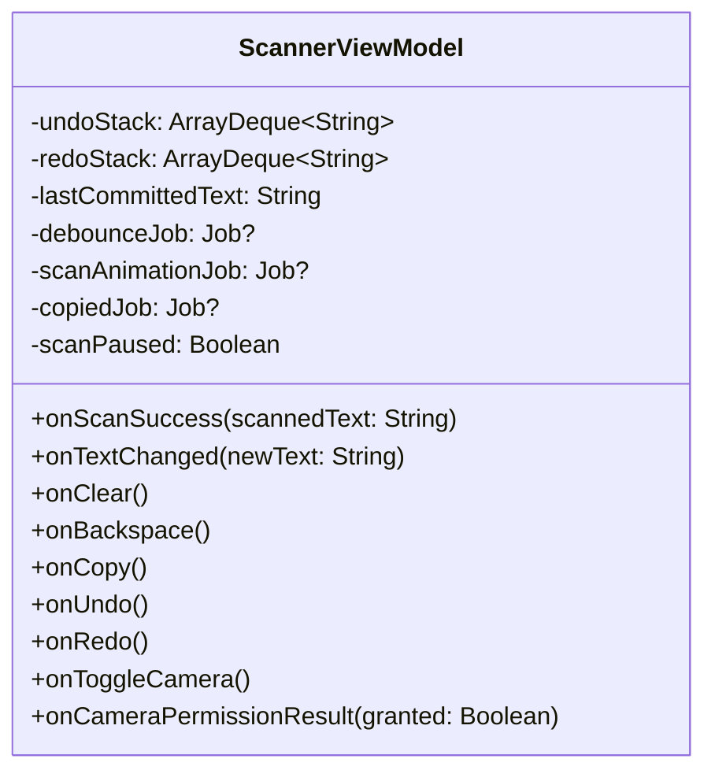

---

## 4. 核心算法设计

### 4.1 统一快照栈 — Undo/Redo 方案

#### 4.1.1 数据结构

```
undoStack: ArrayDeque<String>  — 历史快照，栈顶 = 最近一次记录
redoStack: ArrayDeque<String>  — 恢复快照，栈顶 = 最近一次撤销
lastCommittedText: String      — 上次入栈的稳定文本（用于 debounce 判定）
```

#### 4.1.2 记录时机

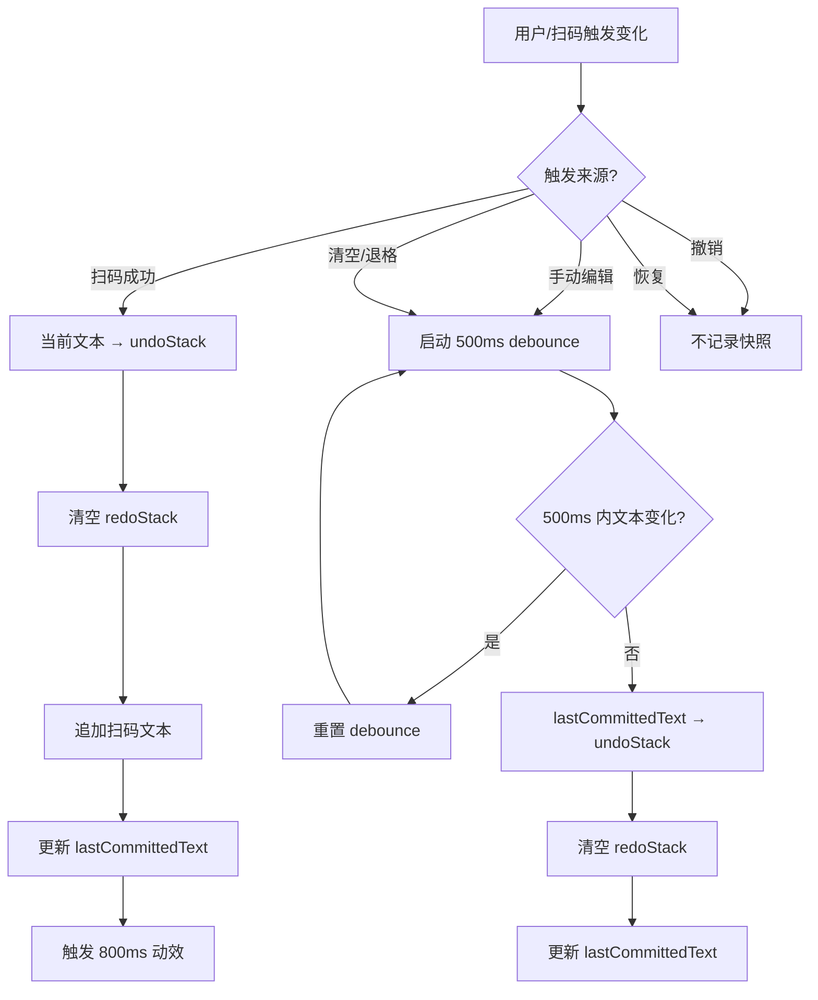

#### 4.1.3 撤销逻辑

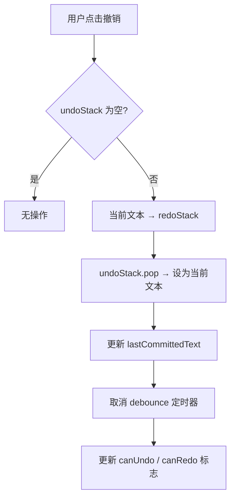

#### 4.1.4 恢复逻辑

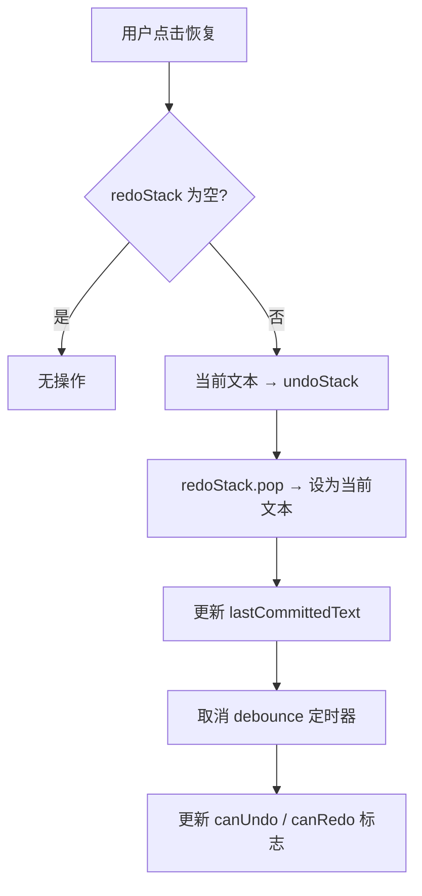

#### 4.1.5 状态示例

| 操作序列 | undoStack | redoStack | 当前文本 | canUndo | canRedo |
|----------|-----------|-----------|----------|---------|---------|
| 初始 | [] | [] | "" | ❌ | ❌ |
| 扫码"A" | [""] | [] | "A" | ✅ | ❌ |
| 扫码"B" | ["", "A"] | [] | "AB" | ✅ | ❌ |
| 撤销 | [""] | ["AB"] | "A" | ✅ | ✅ |
| 撤销 | [] | ["AB", "A"] | "" | ❌ | ✅ |
| 恢复 | [""] | ["AB"] | "A" | ✅ | ✅ |
| 编辑 → 扫码"C" | ["", "A"] | [] | "AC" | ✅ | ❌ |

### 4.2 扫码暂停保护

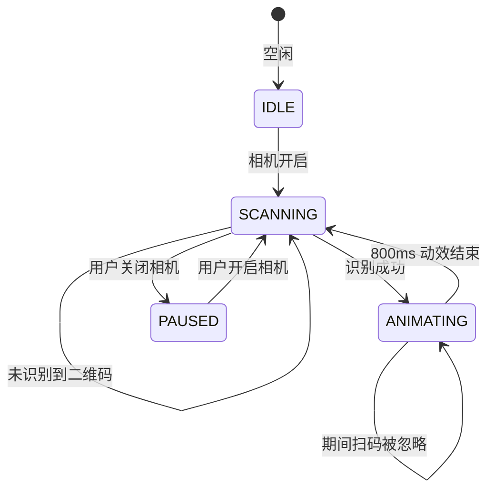

### 4.3 Debounce 防抖

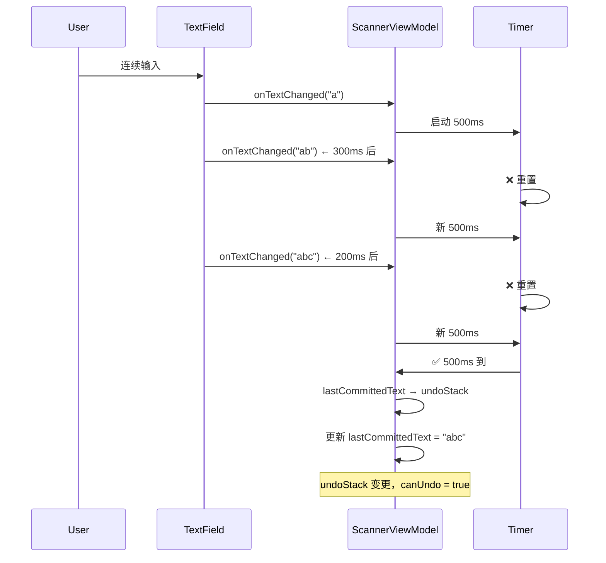

---

## 5. 动画设计

### 5.1 扫描成功动效

| 属性 | 参数 |
|------|------|
| 总时长 | 800ms |
| 进入 | 立即显现（fadeIn 0ms） |
| 退出 | 200ms fadeOut |
| 元素 | ① 四边绿色边框（6dp 宽）② 中心绿色对勾（96dp 圆形背景） |

边框动画：
- `infiniteRepeatable(tween(400), RepeatMode.Reverse)` — alpha 0↔1 循环

对勾动画：
- scale: `tween(300)` 0.5 → 1.0
- alpha: `infiniteRepeatable(tween(400), RepeatMode.Reverse)` 0↔1 循环

### 5.2 复制提示

- 复制成功后 `copied = true`
- 1.5 秒后自动清除
- UI 展示：AnimatedVisibility fadeIn/fadeOut

---

## 6. 权限设计

### 6.1 权限清单

```xml
<uses-permission android:name="android.permission.CAMERA" />
<uses-feature android:name="android.hardware.camera.any" android:required="false" />
```

- `required="false"`：允许无摄像头设备安装，扫码功能不可用但不崩溃

### 6.2 权限请求流程

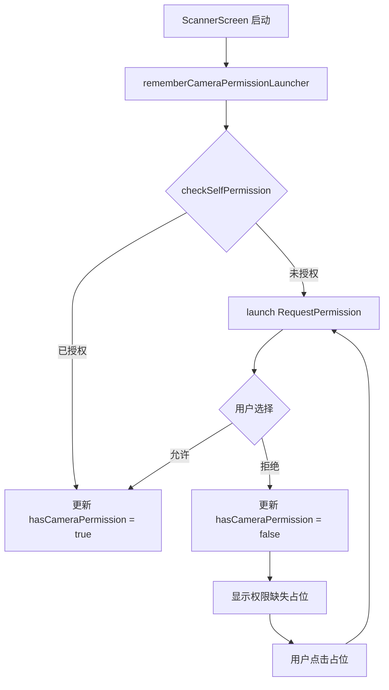

---

## 7. 依赖清单

### 7.1 Version Catalog（gradle/libs.versions.toml）

```toml
[versions]
agp = "8.13.2"
kotlin = "2.0.21"
coreKtx = "1.13.1"
lifecycle = "2.8.7"
activityCompose = "1.9.3"
composeBom = "2024.10.00"
camerax = "1.4.0"
mlkitBarcode = "17.3.0"
junit = "4.13.2"
coroutinesTest = "1.9.0"
```

### 7.2 核心依赖分组

| 分组 | 依赖 |
|------|------|
| AndroidX Core | core-ktx |
| Lifecycle | lifecycle-runtime-ktx, lifecycle-viewmodel-compose, lifecycle-runtime-compose |
| Compose | compose-bom(BOM), ui, ui-graphics, ui-tooling, ui-tooling-preview, material3, material-icons-extended |
| Activity | activity-compose |
| CameraX | camera-core, camera-camera2, camera-lifecycle, camera-view |
| ML Kit | mlkit-barcode-scanning |
| 测试 | junit, kotlinx-coroutines-test, androidx-junit, androidx-espresso-core |

---

## 8. 测试策略

### 8.1 测试覆盖矩阵

| 测试类别 | 用例数 | 覆盖范围 |
|----------|--------|----------|
| ViewModel 单元测试 | 19 | 初始状态、扫码追加、连续扫码、动效定时、debounce、清空、退格、undo/redo 栈状态、相机开关、权限更新、剪贴板提示 |

### 8.2 测试关键场景

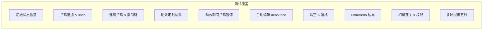

### 8.3 测试工具

- **测试框架**：JUnit 4
- **协程测试**：`kotlinx-coroutines-test`（`StandardTestDispatcher` + `advanceTimeBy` / `advanceUntilIdle`）
- **测试替身**：无 mock，直接用 ViewModel 实例测试状态变化

---

## 9. 构建配置

### 9.1 gradle.properties

```properties
org.gradle.jvmargs=-Xmx2048m -Dfile.encoding=UTF-8
org.gradle.parallel=true
org.gradle.caching=true
android.useAndroidX=true
kotlin.code.style=official
android.nonTransitiveRClass=true
```

### 9.2 构建变体

| 变体 | minifyEnabled | ProGuard |
|------|---------------|----------|
| debug | false | 无 |
| release | false（当前） | proguard-android-optimize.txt + proguard-rules.pro |

---

## 10. 完整时序流

### 10.1 扫码全流程

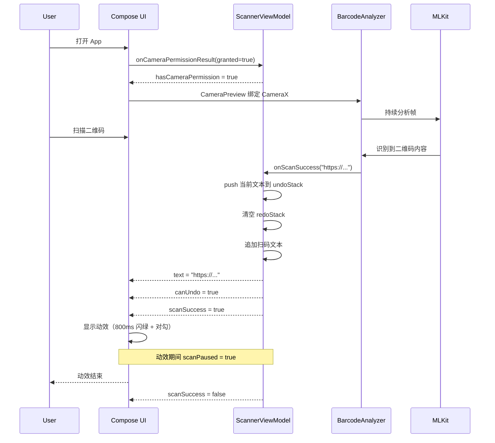

### 10.2 撤销操作时序

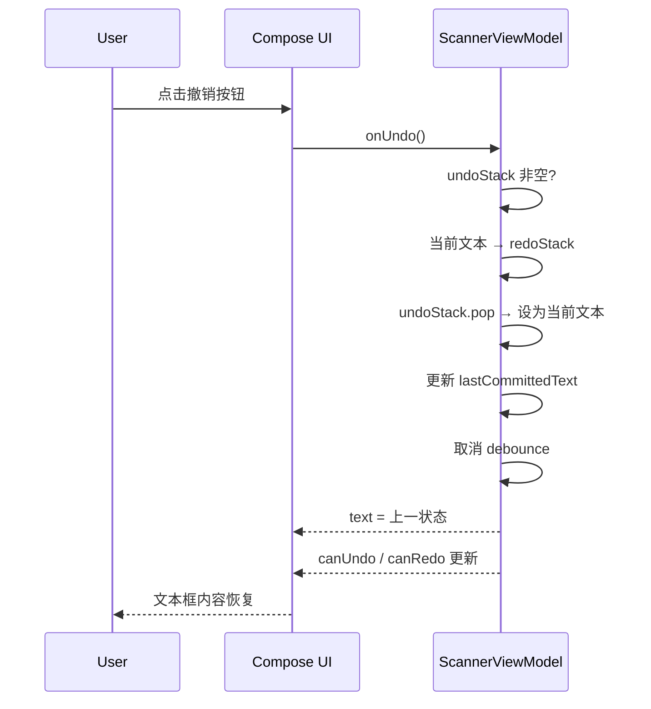

---

## 11. 错误处理与边界情况

| 场景 | 处理方式 |
|------|----------|
| 相机权限拒绝 | 显示权限引导占位，点击重新授权 |
| ML Kit 模型加载失败 | `addOnCompleteListener` 确保 `busy = false` 和 `imageProxy.close()`，不影响相机预览 |
| 剪贴板复制失败 | 系统保证成功率，不做额外处理 |
| 空内容点击清空/退格 | 判断空值直接 return |
| 空栈点击撤销/恢复 | 判断栈空直接 return |
| CameraX 绑定失败 | try-catch 包围，保留黑屏预览 |
| 连续快速扫码 | 800ms 动效 + `scanPaused` 标志双重保护 |

---

## 12. 性能考虑

- **ImageAnalysis 背压策略**：`STRATEGY_KEEP_ONLY_LATEST`，分析器忙时丢弃中间帧
- **@Volatile busy 标志**：轻量级帧跳过，无锁开销
- **debounce 机制**：避免每次键盘输入都写入栈，合并连续编辑
- **CameraX 生命周期绑定**：关闭相机时 `cameraProvider.unbindAll()` 释放资源
- **无持久化**：数据不落盘，扫码即用即走

---

## 13. 附录

### 13.1 文件清单

```
QRCode/
├── README.md
├── build.gradle.kts                         # 根构建脚本
├── settings.gradle.kts                      # 项目设置
├── gradle.properties                        # Gradle 配置
├── gradle/
│   └── libs.versions.toml                   # 版本目录
├── local.properties                         # 本地 SDK 路径
├── .gitignore
├── docs/
│   ├── system-design.md                     # 本文件
│   └── superpowers/specs/
│       └── 2026-07-10-qr-scanner-text-parser-design.md  # 原始设计文档
└── app/
    ├── build.gradle.kts                     # 应用构建脚本
    ├── proguard-rules.pro
    └── src/
        ├── main/
        │   ├── AndroidManifest.xml
        │   ├── java/com/example/qrcode/
        │   │   ├── MainActivity.kt
        │   │   ├── ui/
        │   │   │   ├── ScannerScreen.kt
        │   │   │   ├── CameraSection.kt
        │   │   │   ├── TextEditorSection.kt
        │   │   │   └── theme/Theme.kt
        │   │   ├── viewmodel/
        │   │   │   └── ScannerViewModel.kt
        │   │   └── util/
        │   │       └── BarcodeAnalyzer.kt
        │   └── res/
        │       ├── drawable/
        │       ├── mipmap-anydpi-v26/
        │       ├── values/
        │       │   ├── colors.xml
        │       │   ├── strings.xml
        │       │   └── themes.xml
        │       └── xml/
        └── test/java/com/example/qrcode/viewmodel/
            └── ScannerViewModelTest.kt
```

### 13.2 版本历史

| 日期 | 版本 | 变更 |
|------|------|------|
| 2026-07-10 | 1.0 | 初始设计文档 |
| 2026-07-13 | 1.0 | 生成本系统详细设计文档 |

---

> **设计原则**：简单、稳健、可测试。小而美的工具应用，没有过度设计。
